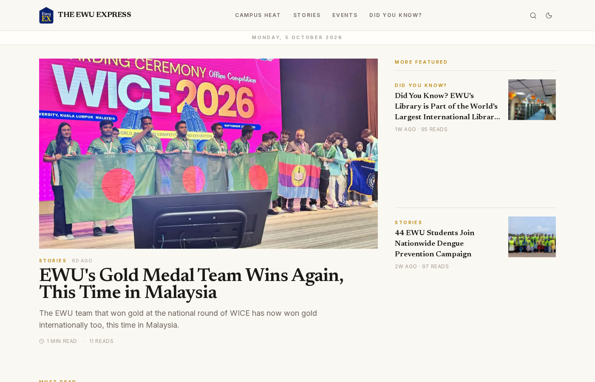
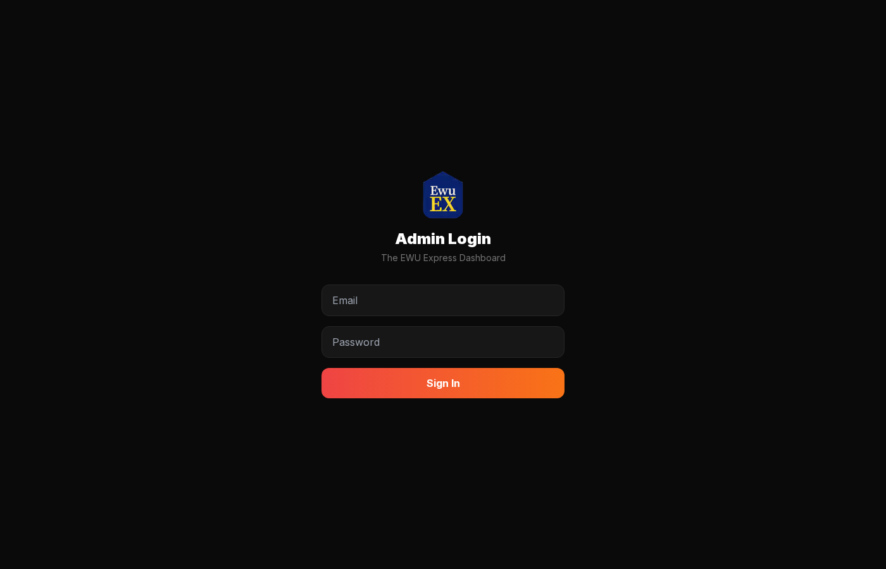

# The EWU Express

The EWU Express is the student news publication of East West University — a campus media platform where stories are published without a category and assigned editorially, subscribers get new stories by email (double opt-in), and everything is run from a password-protected admin dashboard. It is deployed at [theewuexpress.vercel.app](https://theewuexpress.vercel.app) and actively run by the editorial team.

**Status:** deployed and actively run campus product.



## Features

- **Social Media-Style Feed** — Infinite scroll, featured carousel, trending system
- **Clean Article Pages** — Distraction-free reading with hero images, share buttons, view counts
- **Modern Admin Dashboard** — Rich text editor (Tiptap), image uploads, category assignment queue, analytics, authentication
- **Category Workflow** — Posts can be published without a category, then assigned individually from the admin panel
- **Newsletter** — Double opt-in subscriptions, queue-based delivery, unsubscribe links in every email
- **Turso Cloud Database** — Persistent SQLite-compatible storage (no data loss on redeploy)
- **Dark/Light Mode** — System-aware theme switching
- **Search** — Full-text search across stories
- **Categories** — Campus Heat, Stories, Events, Did You Know?
- **Responsive** — Mobile-first design with swipeable featured carousel
- **SEO Optimized** — Meta tags, Open Graph, sitemap, RSS feed at `/rss`

## Screenshots

| Feed | Article |
| --- | --- |
|  |  |

| Admin login | |
| --- | --- |
|  | |

## Tech Stack

- **Framework:** Next.js 14 (App Router)
- **Styling:** Tailwind CSS + Typography plugin
- **Database:** Turso (libSQL) with local SQLite fallback
- **ORM:** Drizzle ORM
- **Editor:** Tiptap 3 (WYSIWYG rich text)
- **Auth:** NextAuth.js v5
- **Animations:** Framer Motion
- **Icons:** Lucide React

## Getting Started

1. **Install dependencies:**
   ```bash
   npm install
   ```

2. **Set up environment:**
   ```bash
   cp .env.example .env.local
   ```

3. **Set up database:**
   ```bash
   npm run db:setup
   ```

4. **Run development server:**
   ```bash
   npm run dev
   ```

5. **Open** [http://localhost:3000](http://localhost:3000)

## Database (Turso)

By default (no `DATABASE_URL`), the app uses a local SQLite file `local.db`.
For production, connect Turso so data survives redeploys:

```env
DATABASE_URL=libsql://your-db.turso.io
DATABASE_AUTH_TOKEN=your-token
```

Migrate + seed the cloud DB with the same scripts:

```bash
npm run db:setup
```

**Already have a local.db with posts?** Import it into Turso:

```bash
npm run db:migrate -- --import ./local.db
```

Legacy categories (`confessions`, `real-talk`) are automatically moved to the
uncategorized pool during import — assign them from the admin panel.

## Admin Access

- **URL:** `/admin/login`
- **Credentials** come from the environment: set `ADMIN_EMAIL` and `ADMIN_PASSWORD` before running `npm run db:setup` (see `.env.example`), then change the dev default after first login. The weak default is only ever applied to a **local** database — a remote/production database is never seeded with a guessable password.
- Forgot the password? Reset it without touching anything else: `ADMIN_PASSWORD='your-new-password' npm run db:password` (works against local and Turso databases).

## Managing the Admin Account

There are two supported ways to manage the admin login:

1. **Admin panel — Settings page (`/admin/settings`).** While signed in, the
   *Admin account* card changes the password (current password required, minimum
   8 characters, stored bcrypt-hashed). The same page also manages the
   newsletter sender: the Gmail address and App Password used for sending
   (stored in the database, never displayed again), the sender name, the site
   URL newsletter links point to, the CAN-SPAM postal address, the privacy
   contact email, and a "send test email" button.

2. **`src/db/set-password.ts` (via `npm run db:password`).** The recovery path
   when the password is forgotten. It sets or creates the admin login and
   touches nothing else — no sample posts, no schema changes. It requires
   `ADMIN_PASSWORD` (minimum 8 characters) and targets whatever database
   `DATABASE_URL`/`DATABASE_AUTH_TOKEN` point at (Turso when set, `local.db`
   otherwise):

   ```bash
   ADMIN_EMAIL='admin@yoursite.com' ADMIN_PASSWORD='your-new-password' npm run db:password
   ```

## Category Workflow

1. Writers publish posts without picking a category (optional field).
2. The **All Posts** page highlights uncategorized posts at the top with an
   amber **"Needs Category"** filter and count badge.
3. Click **Assign category** on any post to set it inline — no full edit needed.

## Scripts

| Command | Description |
|---------|-------------|
| `npm run dev` | Start development server |
| `npm run build` | Build for production |
| `npm run start` | Start production server |
| `npm run lint` | Run ESLint |
| `npm test` | Run unit tests once (Vitest); `npm run test:watch` to watch |
| `npm run db:migrate` | Create/repair tables; with `--import <file>` copies posts + admin users from an existing SQLite file (see below) |
| `npm run db:seed` | Seed sample data (posts + admin account; respects `ADMIN_EMAIL`/`ADMIN_PASSWORD`, skips guessable passwords on remote DBs) |
| `npm run db:password` | Set or reset the admin password only (no sample data) |
| `npm run db:setup` | Migrate + seed |

## Project Structure

```
src/
├── app/             # Next.js App Router pages
│   ├── admin/       # Admin dashboard (incl. settings page)
│   ├── api/         # API routes
│   ├── article/     # Article pages
│   ├── category/    # Category pages
│   └── search/      # Search page
├── components/      # React components
│   ├── admin/       # Admin components (incl. Tiptap editor)
│   ├── article/     # Article components
│   ├── home/        # Homepage components
│   └── layout/      # Layout components
├── db/              # Database schema, migrations & seed scripts
└── lib/             # Utilities & helpers (auth, newsletter, feed, etc.)
```

## Security & Governance

- Report vulnerabilities privately — see [SECURITY.md](SECURITY.md). Please do
  not open public issues for security problems.
